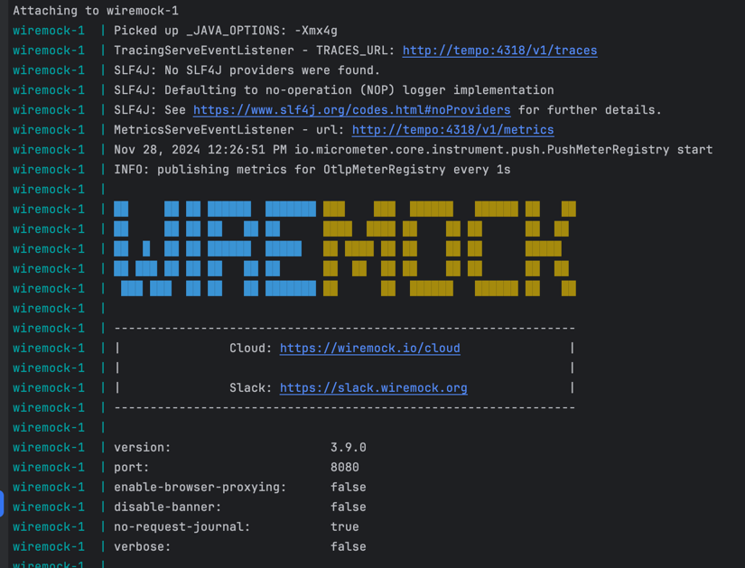
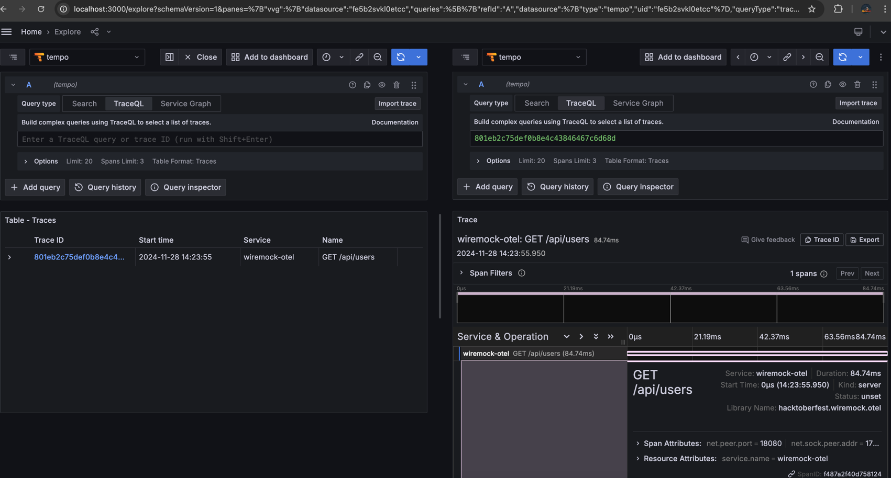

# WireMock extension for OpenTelemetry

> **INFO:** This extension is under development and will be released soon.
> Contributions are welcome!

The extension prototype was created during HAcktoberfest 2023.
More patches are needed before it could be released as an alpha version.
If you are interested in this extension,
please contact us on the [community Slack](https://slack.wiremock.org/).

## References

- [GitHub Repository](https://github.com/wiremock/wiremock-otel-extension)
- [GitHub Issue for discussion](https://github.com/wiremock/wiremock/issues/2416)

Command to generate the fat jar:
```shell
gradle shadowJar
```
The `wiremock-extension-all.jar` can be imported in the Wiremock instance
and both metrics and tracing extension are activated
```yaml
services:
  wiremock:
    image: 'wiremock/wiremock:latest'
    volumes:
      - ./wiremock/wiremock-extension-all.jar:/var/wiremock/extensions/wiremock-extension.jar
      - ./wiremock/__files:/home/wiremock/__files
      - ./wiremock/mappings:/home/wiremock/mappings
    environment:
      - '_JAVA_OPTIONS=-Xmx4g'
      - 'METRICS_URL=http://tempo:4318/v1/metrics'
      - 'TRACES_URL=http://tempo:4318/v1/traces'
    entrypoint: ["/docker-entrypoint.sh", "--global-response-templating"]
    ports:
      - '18080:8080'
      
```



Call any endpoint from Wiremock
```bash
curl -v http://localhost:18080/api/users
```

Check the tracing in Grafana:

